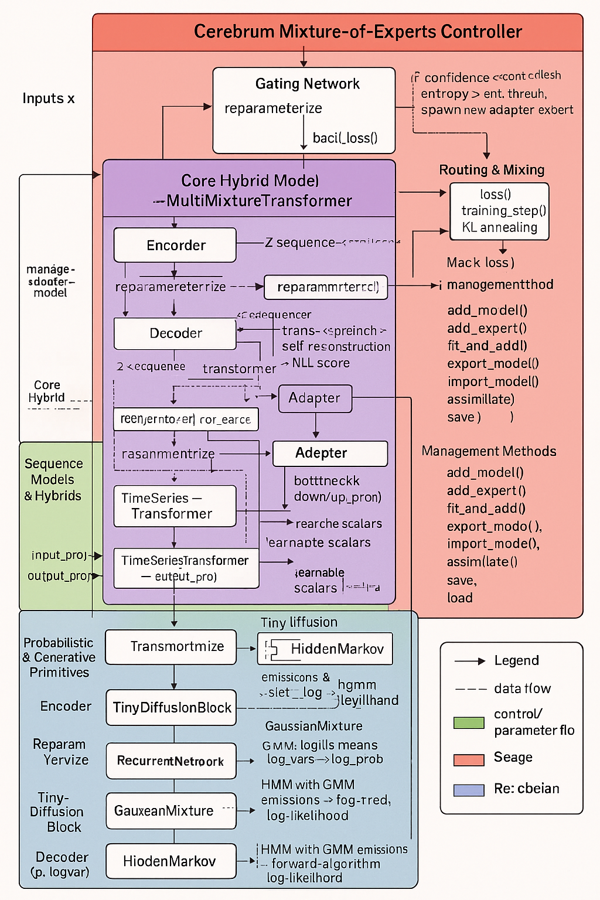

# Cerebrum: A Multi-Mixture Model


## Table of Contents

1. [Abstract](#abstract)
2. [Introduction](#introduction)
3. [System Architecture](#system-architecture)

   1. [Configuration System](#1-configuration-system)
   2. [Adapter Module](#2-adapter-module--make_adapter_model)
   3. [Variational Blocks (VAE)](#3-variational-blocks-vae)
   4. [Diffusion & Draft Scoring](#4-diffusion--draft-scoring)
   5. [Recurrent & Statistical Models](#5-recurrent--statistical-models)
   6. [Transformer for Time Series](#6-transformer-for-time-series)
   7. [MultiMixtureTransformer: Hybrid Sequence Model](#7-multimixturetransformer-hybrid-sequence-model)
   8. [Cerebrum Controller & MoE Dynamics](#8-cerebrum-controller--moe-dynamics)
4. [Data Flow & Computational Graph](#data-flow--computational-graph)
5. [Training Procedures](#training-procedures)
6. [Inference & Generation](#inference--generation)
8. [Use Examples](#use-examples)
9. [Adding Custom Submodules](#adding-custom-submodules)
10. [Component Summary](#component-summary)
11. [Installation](#installation)
12. [Conclusion](#conclusion)
13. [Licensing](#licensing)
14. [Acknowledgments](#acknowledgments)

---

## Abstract

Cerebrum is a unified framework combining probabilistic mixtures (GMM, HMM) and deep generative architectures (VAE, diffusion, Transformer) into a cohesive platform. It offers:

* **MM**: single-model wrapper with `.fit()`, `.score()`, and serialization.
* **MMMan**: manager of multiple mixture instances with bulk operations.
* **MultiMixtureTransformer**: hybrid VAE + RNN‑HMM + diffusion + Transformer.
* **Cerebrum Controller**: dynamic Mixture-of-Experts routing learned adapters and legacy models.

---

## Introduction

Building hybrid models across statistical and neural paradigms requires consistent interfaces, flexible management, and composable building blocks. Cerebrum addresses this by:

1. **Unified APIs** across model types.
2. **Hierarchical containers**: from single MM to MMMan to top-level Cerebrum.
3. **Composable modules** enabling rapid prototyping of complex pipelines.

---

## System Architecture

This section details each module and its core functions:

### 1. Configuration System

* **`CerebrumConfig.to_dict()`** → `Dict[str, Any]`

  ```python
  {
    'input_dim': self.input_dim,
    'hidden_dim': self.hidden_dim,
    'z_dim': self.z_dim,
    'rnn_hidden': self.rnn_hidden,
    'num_states': self.num_states,
    'n_mix': self.n_mix,
    'trans_d_model': self.trans_d_model,
    'trans_nhead': self.trans_nhead,
    'trans_layers': self.trans_layers,
    'output_dim': self.output_dim
  }
  ```
* **Factory methods** (`CerebrumConfigs.eeg_cerebrum()`, `tts_cerebrum()`, etc.) return presets for common tasks.

### 2. Adapter Module & `make_adapter_model`

* **`Adapter.forward(x: Tensor)`** → `Tensor`

  1. `down_proj`: Linear(`d_model` → `adapter_dim`)
  2. `ReLU`
  3. `up_proj`: Linear(`adapter_dim` → `d_model`)

* **`make_adapter_model(base_model, base_config, flat_params)`**:

  1. Deep-copy `base_model`.
  2. Insert `Adapter` layers at specified `layer_positions`.
  3. Unpack `flat_params` into each adapter’s weights & biases.
  4. Return modified model.

### 3. Variational Blocks (VAE)

* **`Encoder.forward(x: Tensor)`** → `(mu, logvar)`

  1. `h = ReLU(fc1(x))`
  2. `mu = fc_mu(h)`
  3. `logvar = fc_logvar(h)`

* **`Decoder.forward(z: Tensor)`** → `recon` in \[0,1]

  1. `h = ReLU(fc1(z))`
  2. `out = Sigmoid(fc_out(h))`

### 4. Diffusion & Draft Scoring

* **`TinyDiffusionBlock.denoise(x: Tensor)`** → `Tensor`

  1. MLP(`block_dim` → `2*block_dim`) + `ReLU` → back to `block_dim`
  2. Residual: `x + 0.1 * net(x)`

* **`DraftScorer.forward(draft_tokens, z_plan)`** → `score`
  Cross-attend token drafts to `z_plan`, autoregressively decode, compute average log-likelihood.

### 5. Recurrent & Statistical Models

* **`RecurrentNetwork.forward(x: Tensor)`** → `(emissions, transitions)`
  LSTM → log-softmax emission and transition matrices.

* **`GaussianMixture`**: `get_weights()`, `get_means()`, `get_variances()`, `log_prob(X)`, `score(X)`.

* **`HiddenMarkov`**: `get_initial_prob()`, `get_transition_matrix()`, `log_prob(X)`, batch `score(X)`.

### 6. Transformer for Time Series

* **`TimeSeriesTransformer.forward(src, tgt)`** → `Tensor`
  Project inputs to `d_model`, run `nn.Transformer`, project to `output_dim`.

### 7. MultiMixtureTransformer: Hybrid Sequence Model

Key components:

* VAE (`Encoder`, `Decoder`)
* RNN‑HMM (`RecurrentNetwork`, `HiddenMarkov`)
* `TinyDiffusionBlock`, `DraftScorer`
* `TimeSeriesTransformer`
* Learned weight vectors: `pred_`, `recog_`, `gen_`, `reg_weights`
* Optional token modules: `auto_decoder`, `to_vocab`

**Key methods:**

* `reparameterize(mu, logvar)`
* `forward(x, tgt=None)` returns reconstruction, latents, emissions, transitions, likelihoods, transformer output
* `loss(x, outputs)`: reconstruction + KL divergence + HMM NLL
* `predict(x)`, `recognize(x, tgt_z)`, `generate(num_steps)`, `regression()` + losses

### 8. Cerebrum Controller & MoE Dynamics

* **Constructor**: initializes experts, `self.gate`, `self.task_encoder`, `self.hypernet`, thresholds, `temperature`.
* **`add_model()` / `add_expert()`**: register legacy or adapter experts.
* **`forward(x)`**:

  1. Compute summary, obtain expert probabilities.
  2. Measure confidence/entropy; spawn new adapters via `_spawn_expert()` if needed.
  3. Mix expert outputs with `load_loss` penalty.
* **`fit_and_add()`**: fits GMM/HMM via `MMMan` or trains MMM with KL annealing and gradient clipping.
* **Persistence**: `export_model()`, `import_model()`, `save()`, `load()`, `assimilate()`.

## Data Flow & Computational Graph



---

## Training Procedures

1. **GMM/HMM MLE** using Adam to minimize negative log-likelihood.
2. **Hybrid MMM**: forward pass → compute reconstruction loss, KL divergence, HMM NLL; apply annealing schedules; clip gradients.
3. **Auxiliary Rules**: `add_rule()` + `back_loss()` enforcing constraints on learned weight vectors.

---

## Inference & Generation

* **Scoring**: `.score()` returns average log-likelihood.
* **Sampling**: `generate()` for continuous sequences; `regression()` for CoRe² drafting of token sequences.

---

# Use Examples

Below are comprehensive examples covering all major workflows.

---

### 1. Basic GMM/HMM Operations

```python
from cerebrum import Cerebrum, MMMan

brain = Cerebrum()
# Fit a new GMM on data matrix X_gmm
gmm_id = brain.fit_and_add(data=X_gmm, model_type='gmm', n_components=4, model_id='my_gmm')
# Score test data under this GMM
gmm_score = brain.score('my_gmm', X_test)
# Retrieve component parameters
means = brain.get_means('my_gmm')
variances = brain.get_variances('my_gmm')
weights = brain.get_weights('my_gmm')

# Fit an HMM on sequence data
hmm_id = brain.fit_and_add(data=seq_data, model_type='hmm', n_components=3, n_mix=2)
# Per-sequence log-likelihoods
lls = brain.get_log_likelihoods(hmm_id, seq_data)
# Remove an unused model
brain.models['my_gmm'].unfit('my_gmm')  # for MMMan-based managers
```

### 2. Managing Multiple Submodels with MMMan

```python
from cerebrum import MMMan, GaussianMixture

mmman = MMMan()
# Absorb pre-trained GMM instance
pre_gmm = GaussianMixture(5, 10)
mmman.fit(data=pre_gmm, model_type='gmm', data_id=0)
# Fit HMM and GMM together
mmman.fit(data=lh_seq, model_type='hmm', n_components=2, n_mix=3, data_id='hmm_seq')

# Bulk queries
all_means = mmman.get_means()         # dict of all stored models
single_means = mmman.get_means(0)     # numpy array for model id 0
scores = mmman.score(seq_data_batch)  # dict of scores per model
```

### 3. Hybrid MMM: MultiMixtureTransformer

```python
# Fit-and-add an end-to-end hybrid model
detail_params = dict(
    input_dim=16, hidden_dim=64, z_dim=32, rnn_hidden=128,
    num_states=4, n_mix=2,
    trans_d_model=32, trans_nhead=4, trans_layers=3,
    output_dim=16,
    epochs=200, kl_anneal_epochs=50,
    clip_norm=2.0, weight_decay=1e-4
)
mmm_id = brain.fit_and_add(data=ts_data, model_type='mmm', **detail_params)

# Prediction, recognition, generation
x_next       = brain.models[mmm_id].predict(x_current)
z_target     = torch.randn_like(x_current)
reconstructed = brain.models[mmm_id].recognize(x_current, tgt_z=z_target)
gen_seq      = brain.models[mmm_id].generate(num_steps=10, batch_size=2)

# Regression / CoRe² drafting
logits, entropy_penalty = brain.models[mmm_id].regression(context_sequence)
loss = brain.models[mmm_id].regression_loss(context_sequence, target_tokens)
```

### 4. Auxiliary Features & Meta-Operations

```python
# Rule-based auxiliary loss
model = brain.models[mmm_id]
model.add_rule(name='pred_balance', label='pred', reward_target=0.5, reward=10.0)
optimizer = torch.optim.Adam(model.parameters())
loss = model.training_step(x_batch, optimizer)

# Export & Import state
state = brain.export_model(mmm_id)
brain.import_model(mmm_id, state)

# Check stored IDs
ids_map = brain.models['MMMan'].check_data()

# Assimilate and full save/load
brain.assimilate('other_brain.pt')
brain.save('cerebrum_full.pt')
new_brain = Cerebrum.load('cerebrum_full.pt')
```

---

## B. Config-Based Usage (`CerebrumConfig`)

The new `CerebrumConfig` system offers predefined presets plus full customizability. Both legacy and config-based calls coexist seamlessly.

### Quick Start

```python
from modeling_cerebrum import Cerebrum, CerebrumConfigs
import torch

cerebrum = Cerebrum()
# Train an EEG-Cerebrum in three lines:
config   = CerebrumConfigs.eeg_cerebrum()
data     = torch.randn(100, 32, config.input_dim)
model_id = cerebrum.fit_and_add(data=data, config=config, epochs=100)
```

### 1. EEG-Cerebrum (Seizure Prediction)

```python
eeg_config = CerebrumConfigs.eeg_cerebrum()
eeg_data   = torch.randn(time_steps, batch_size, eeg_config.input_dim)
model_id   = cerebrum.fit_and_add(data=eeg_data, config=eeg_config, epochs=150, learning_rate=1e-4)
```

### 2. TTS-Cerebrum (Voice Cloning)

```python
tts_config = CerebrumConfigs.tts_cerebrum()
tts_data   = torch.randn(seq_length, batch_size, tts_config.input_dim)
model_id   = cerebrum.fit_and_add(data=tts_data, config=tts_config, epochs=200, kl_anneal_epochs=50)
```

### 3. SpeakerRecognition-Cerebrum (Speaker Identification)

```python
spk_config    = CerebrumConfigs.speaker_recognition_cerebrum()
speaker_data  = torch.randn(seq_length, batch_size, spk_config.input_dim)
model_id      = cerebrum.fit_and_add(data=speaker_data, config=spk_config, epochs=120)
```

### 4. Conversational-Cerebrum (Text Generation)

```python
conv_config = CerebrumConfigs.conversational_cerebrum()
conv_data   = torch.randn(seq_length, batch_size, conv_config.input_dim)
model_id    = cerebrum.fit_and_add(data=conv_data, config=conv_config, epochs=150, label_smoothing=0.1)
```

### 5. Custom Configuration

```python
from modeling_cerebrum import CerebrumConfig

custom_config = CerebrumConfig(
    input_dim=128, hidden_dim=512, z_dim=256,
    num_states=16, n_mix=3,
    kl_anneal_epochs=75, learning_rate=5e-5
)
model_id = cerebrum.fit_and_add(data=your_data, config=custom_config, epochs=200)
```

### Model Management

```python
print("Models:", list(cerebrum.models.keys()))
# Export/import individual models or full state
e brain.export_model(model_id, "model.pt")
brain.import_model(model_id, "model.pt")
brain.save("cerebrum_brain.pt")
loaded = Cerebrum.load("cerebrum_brain.pt")
```

```python
from cerebrum import Cerebrum

brain = Cerebrum()
# 1. Fit GMM
gmm_id = brain.fit_and_add(data=X, model_type='gmm', n_components=4)
score = brain.score(gmm_id, X_test)

# 2. Hybrid MMM
cfg = CerebrumConfigs.eeg_cerebrum()
mmm_id = brain.fit_and_add(data=ts_data, config=cfg, model_type='mmm', epochs=100)
recon, mu, logvar = brain.models[mmm_id].forward(ts_data)['reconstruction']

# 3. Dynamic MoE
output = brain.models['controller'].forward(new_input)
```

---

## Adding Custom Submodules

Cerebrum's `model_type_map` is designed to be extended via custom submodules. To add your own models:

1. **Create a submodule** directory, e.g., `my_submodule/` alongside `sub_module/`.
2. **Define your custom model classes** in a `configuration_<name>.py` (for configs) or `<model>.py`:

   ```python
   # my_submodule/custom_model.py
   class MyCustomModel:
       def __init__(self, **kwargs):
           # initialize your model
           ...
       def fit(self, data):
           ...
       def score(self, data):
           ...
   ```
3. **Import and register** your models in `sub_module/sub_mod.py`:

   ```python
   # sub_module/sub_mod.py
   # 1. Start with any pre-registered entries
   model_type_map = {}

   # 2. Import your custom models
   from my_submodule.custom_model import MyCustomModel
   model_type_map['my_custom'] = MyCustomModel

   # 3. Optionally merge Hugging Face Transformers types
   try:
       from transformers import CONFIG_MAPPING
       for cfg in CONFIG_MAPPING.values():
           model_type_map.setdefault(cfg.model_type, cfg)
   except ImportError:
       pass
   ```
4. **Use** your custom type via `model_type='my_custom'` in `fit_and_add`:

   ```python
   from cerebrum import Cerebrum

   brain = Cerebrum()
   model_id = brain.fit_and_add(data=my_data, model_type='my_custom', arg1=..., arg2=...)
   ```

This pattern ensures your custom models load first and that available Transformer types augment the registry when installed.

---

---

## Component Summary

| Component      | Role                                                 |
| -------------- | ---------------------------------------------------- |
| `GaussianMixture` | Mixture density model                                |
| `HiddenMarkov` | HMM with GMM emissions                               |
| `MM`           | Single-model wrapper for GMM/HMM                     |
| `MMMan`        | Manager of multiple mixture models                   |
| `TimeSeriesTransformer` | Seq2Seq Transformer for time series                  |
| `TinyDiffusionBlock` | Residual MLP denoiser                                |
| `DraftScorer`  | Token draft scoring via cross-attention              |
| `MultiMixtureTransformer` | Hybrid pipeline: VAE + HMM + diffusion + Transformer |
| `Cerebrum`     | Dynamic MoE routing and expert management            |

---

## Installation

```bash
pip install -r requirements.txt
```

# Conclusion

Cerebrum represents a significant step forward in unifying probabilistic mixture models and deep neural generative architectures under a single, cohesive interface. By combining GMMs, HMMs, VAEs, diffusion blocks, and Transformers within a modular and extensible framework, Cerebrum enables researchers and practitioners to:

Rapidly prototype complex hybrid pipelines without reinventing low-level components.

Leverage Mixture-of-Experts dynamics to balance legacy statistical models with modern neural adapters, ensuring robustness and adaptability across diverse tasks.

Seamlessly scale from single-model experiments to large ensembles managed by MMMan, simplifying experimentation and deployment.

Incorporate domain‐specific rules and auxiliary losses, extending model behavior with minimal changes to core code.Through these developments, Cerebrum aims to remain at the forefront of hybrid model research, empowering the community to explore novel combinations of probabilistic and neural paradigms with unprecedented ease and flexibility.&#x20;

# Licensing

**Unified Source-Available License and Contributor Agreement**
© 2025 Chance Brownfield
Last updated: June 24, 2025

1. **DEFINITIONS**

   1. **Licensed Work**: any code, model architecture specifications, documentation, and pretrained model weights published by the Licensor.
   2. **Pretrained Model**: any model weights publicly released by the Licensor, trained on the Licensed Work.
   3. **Contribution**: any submission (code, documentation, pretrained models, or other materials) made by a third party to this project.
   4. **Derivative Work**: has the meaning given under applicable copyright law.

2. **PRETRAINED MODELS: CC BY-NC-ND TERMS**

   1. All Pretrained Models are licensed under Creative Commons Attribution-NonCommercial-NoDerivatives 4.0 International.
   2. You may copy and redistribute the Pretrained Models **only** for non-commercial purposes, provided you give appropriate attribution:
      “Pretrained model by Chance Brownfield, licensed CC BY-NC-ND 4.0.”
   3. You may **not** create derivative works of the Pretrained Models or use them commercially without express written permission from Chance Brownfield.

3. **CODE & ARCHITECTURE: BUSINESS SOURCE LICENSE 1.1**

   1. You may copy, modify, create Derivative Works of, and use the Licensed Work **only** for non-production and non-commercial purposes, without further permission.
   2. All production or commercial use—including internal deployment, offering services to third parties, retraining, inference for payment, or embedding in products—**requires explicit written permission** and/or a commercial license from Chance Brownfield.
   3. You may **not** train, refine, or develop any new model using this architecture without the express authorization of Chance Brownfield.
   4. **Change Date:** On June 24, 2029, this section (3) automatically converts to the terms of the GNU General Public License version 2.0 or later, and the restrictions in 3.1–3.3 no longer apply.
   5. Rights granted under this section terminate automatically upon any breach of these terms. Continued use after termination requires a commercial license or cessation of use.

4. **CONTRIBUTOR LICENSE AGREEMENT (CLA)**
   By submitting a Contribution to this project, you agree that:

   1. You own or have the rights to your Contribution.
   2. You grant the Licensor a perpetual, worldwide, non-exclusive, royalty-free, irrevocable license to reproduce, prepare Derivative Works of, distribute, and publicly display or perform your Contribution, and to sublicense these rights under any terms (including proprietary or commercial licenses).
   3. You grant the Licensor a patent license to use any patents you hold that would necessarily be infringed by your Contribution.
   4. You waive all moral rights and any claims against the Licensor arising from use of your Contribution.
   5. You acknowledge and support the Licensor’s enforcement of Sections 2 and 3: all commercial use, retraining, deployment, or derivative architecture development requires explicit permission from Chance Brownfield.

5. **WARRANTY & LIABILITY**
   The Licensed Work and any Contributions are provided “AS IS”, without warranty of any kind. The Licensor and contributors are not liable for any claims or damages arising from use.

6. **GOVERNING LAW**
   This entire Agreement is governed by the laws of the USA, without regard to conflict-of-law principles.

7. **CONTACT & COMMERCIAL LICENSING**
   For any commercial licensing inquiries, or to request permission for training or derivative work, please contact:
   Chance Brownfield
   [ChanceBrownfield3515@gmail.com](mailto:ChanceBrownfield3515@gmail.com)

# Acknowledgments

We gratefully acknowledge the Cerebrum Development Team for their invaluable contributions to the design, implementation, and testing of the Cerebrum Architecture.

| Name                    | Title                                           | Contact Information                            | 
|-------------------------|-------------------------------------------------|------------------------------------------------|
| Chance Brownfield       | Author                                          | ChanceBrownfield3515@gmail.com                 |
|                         | Architectual Specialist                         |                                                |
| Allen P                 | Data Specialist                                 | https://www.freelancer.com/u/allenjames0828    |
| Oliver M                | Training Specialist                             | https://www.freelancer.com/u/oliverm186        |
| ----------------------- | ----------------------------------------------- | ---------------------------------------------- |
